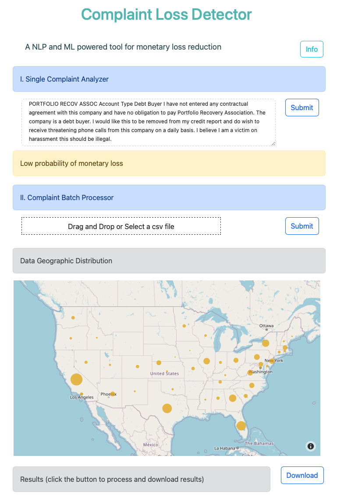

#### About

# Complaint Loss Detector (CLD)

An [application](https://github.com/biomchen/complaint_loss_detector) finding the money loss blackhoe using customer complaints

## **Problem**

Each year, financial institutions have lost millions of dollars due to their customers' complaints. Many complaints are lengthy texts and hard to identify key reasons for filing complaints against those institutions in addition to its large quanity. It is impossible for a financial institutions to conduct thorough analyses and summerization of those complaints just by its customer service team and response the complaints in a timely fashion.

In addition, as more and more products the financial institutions serve, the variety of the complaints becomes even more difficult for identifying the key reasons of customer complaints. As results, the customer service team might miss some of the key reasons for customers' complaints and opportunities to address the complaints with appropriate customer service experts in a correct way, which leads to monetary loss to the complaints.

## **Insights**

## **Data**

CFPB provides a glimpse of [consumers' complaints](https://www.consumerfinance.gov/data-research/consumer-complaints/#download-the-data) against financial institutions, it contains around 3.1M complaints from a variety of the institutions and many of them has been resulted in monetary loss from in intitutions.

The complaints incldues:
* 1.42M complaints were filed against three major credit reporting agencies
    * Only tiny number of them (< 0.1%) were result of monetary loss
* 670K complaints have consumers' complaint narratives against the other finanical institutions.

## **Solutions**
Transform the problem into a unsupervised and supervised ML problem:   

* variable: 'Consumer complaint narrative'
* target: 'Company response to consumer'   

## **Tools and Techs**

* Python
* Data Cleaning + EDA
    * Jupyter
    * Pandas
    * Seaborn
    * Feature Engineering
    * Geopy
    * Folium
* NLP + Modeling
    * NLTK
    * spaCy
    * Scikit-learn
    * Worldcloud
* Deployment
    * Flask
    * Streamlit
    * Dash
    * uWSGI
    * AWS EC2

## **Deployment**

You can use uwsgi to deploy with the following cmd:  
`uwsgi --http-socket 0.0.0.0:3000 --wsgi-file main.py --master --processes 1 --threads 2`  

Click the [link](https://bit.ly/mld_dashboard) for the demo as shown below.  
  
